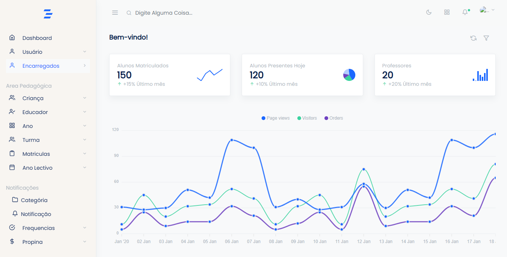

# MySGE - Daycare Management System




## About the Project

MySGE is a daycare management system developed with PHP and Laravel. This system was created to help daycare centers manage their daily operations, including student registration, class management, attendance tracking, and reporting.

## Features

- Student registration
- Class management
- Attendance tracking
- Report generation
- Sending notifications to parents
- Authentication and authorization system

## Technologies used

- PHP
- Laravel
- MySQL
- Bootstrap
- JavaScript
- HTML
- CSS

## Installation

### Prerequisites

- PHP >= 7.4
- Composer
- MySQL

### Installation steps

1. Clone the repository:

```bash
git clone https://github.com/noejunior792/daycare-management-system
cd mysge
```

2. Install the Composer dependencies:

```bash
composer install
```

3. Copy the `.env.example` file to `.env`:

```bash
cp .env.example .env
```

4. Configure the `.env` file with your database credentials.

5. Generate the application key:

```bash
php artisan key:generate
```

6. Run the migrations and seeders to create the initial tables and data:

```bash
php artisan migrate --seed
```

7. Start the local server:

```bash
php artisan serve
```

8. Access the application in your browser:

```
http://localhost:8000
```

## Contribution

Contributions are welcome! Feel free to open an issue or submit a pull request.

1. Fork the repository
2. Create a new branch (`git checkout -b feature/new-feature`)
3. Make your changes and commit (`git commit -m 'Add new feature'`)
4. Push to the remote repository (`git push origin feature/new-feature`)
5. Open a pull request

## License

This project is licensed under the MIT License - see the [LICENSE](LICENSE) file for more details.

---
Developed by [Noé Júnior](https://github.com/noejunior792)